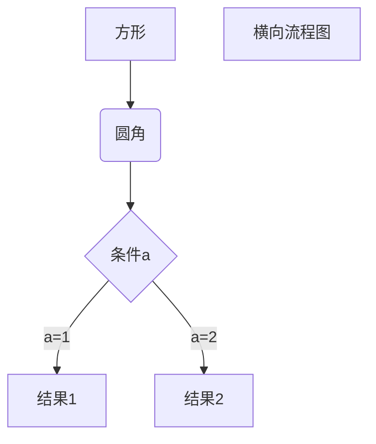

# 一级标题
## 二级标题
### 三级标题
#### 四级
 -- 哈哈 --

 hhh
=
---


*你好*  
**你好**
你好

1. a
   * aa
   * bb
2. b


> a
>> b  
>> c

    func myFunc(){
        fmt.Println("aaa")
    }


`fmt.Print()`

```golang
func min(a, b int) int {
    if a > b {
        return b
    }
    return a
}
```

链接 [菜鸟](https://www.runoob.com/markdown/md-link.html)

| 列1 | 列2 |
| --- | ---|
| 值1 | 值2 |
| 值3 | 值3 |




```sequence
对象A->对象B: 对象B你好吗?（请求）
Note right of 对象B: 对象B的描述
Note left of 对象A: 对象A的描述(提示)
对象B-->对象A: 我很好(响应)
对象A->对象B: 你真的好吗？
```